# BOATLY — ENTITY RELATIONSHIP DIAGRAM

**Version:** 1.1
**Status:** Phase A — Final Approved Specification

Detailed fields live in:

`DATABASE_SCHEMA.md`

---

# 1. IDENTITY / OPERATORS

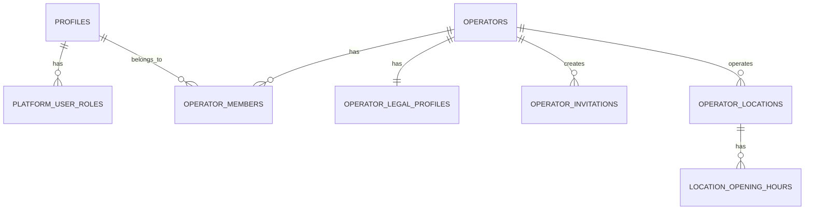

---

# 2. FLEET

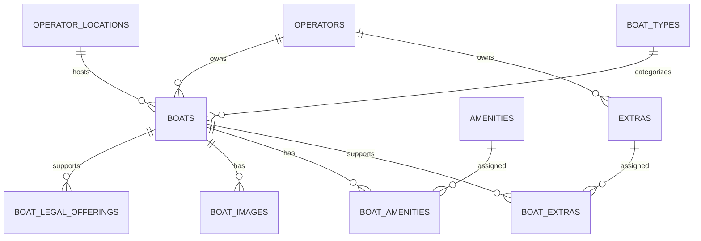

---

# 3. PRICING / AVAILABILITY

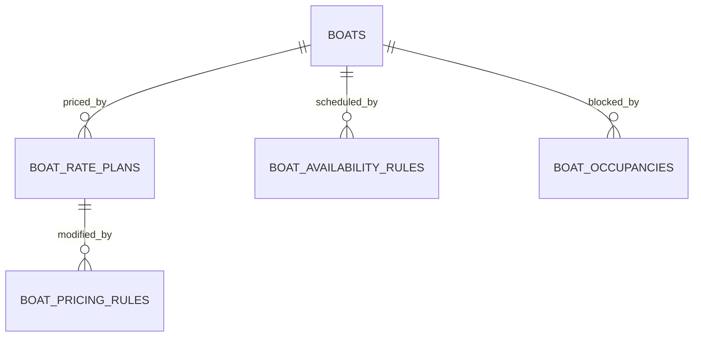

---

# 4. CUSTOMER / CRM / BOOKINGS

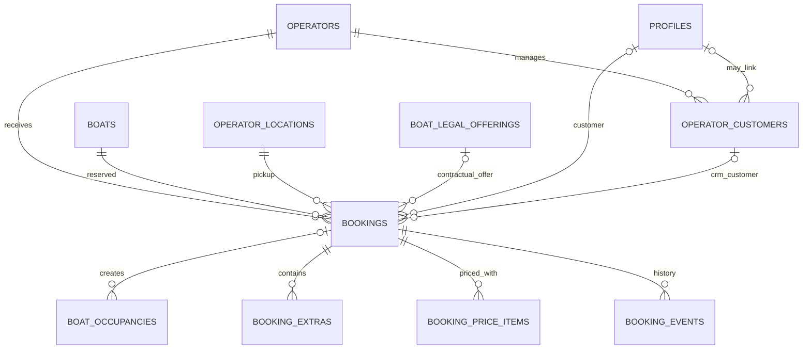

---

# 5. LEGAL / CONTRACTS

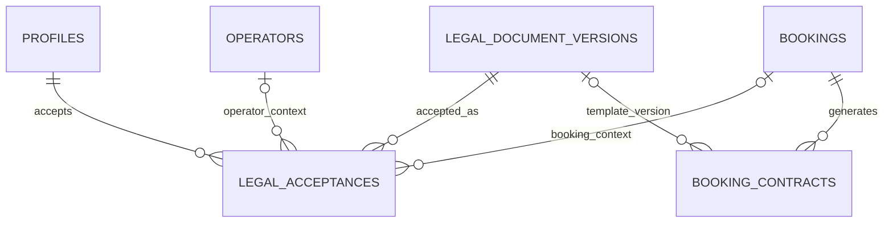

---

# 6. BUSINESS MODEL

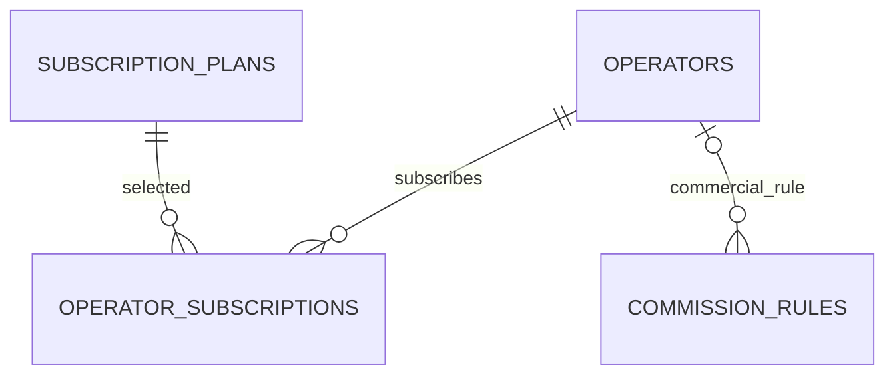

---

# 7. STRIPE / PAYMENTS

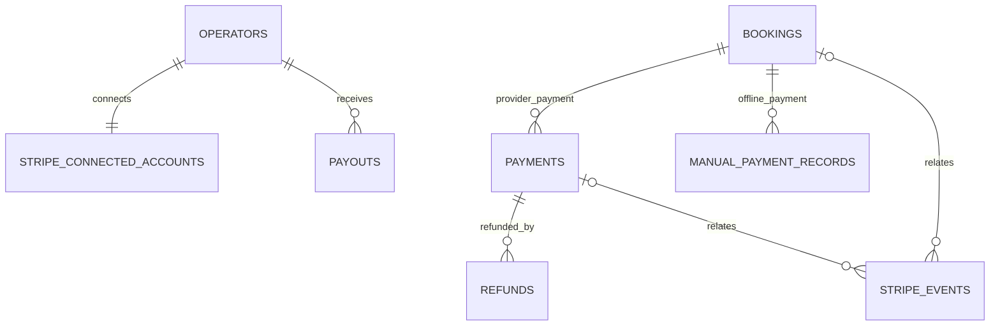

---

# 8. SKIPPERS

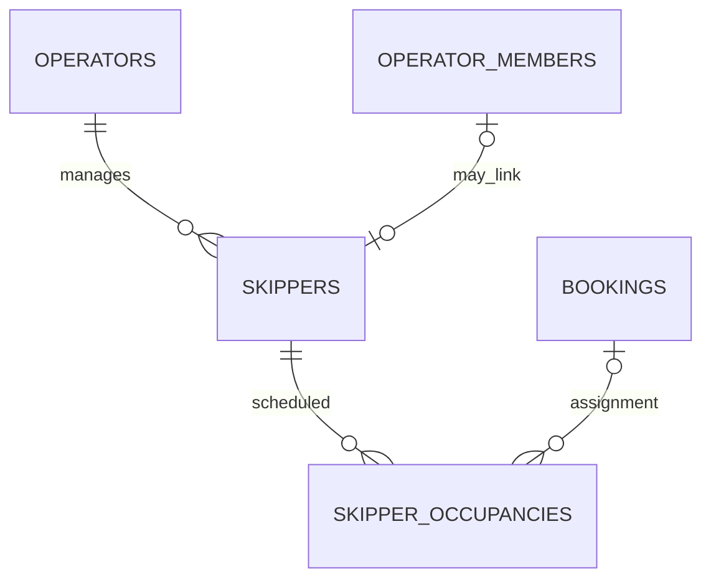

---

# 9. DOCUMENTS / COMPLIANCE

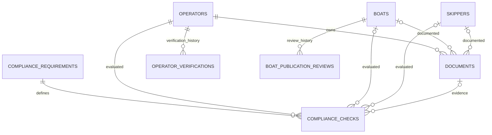

---

# 10. CUSTOMER FEATURES

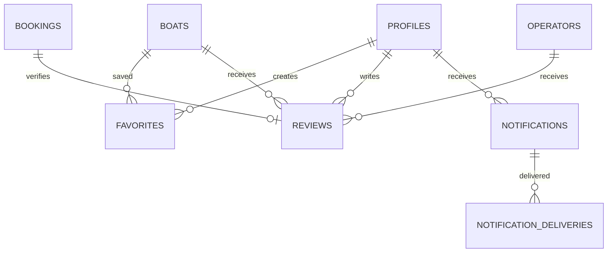

---

# 11. MODERATION / PRIVACY

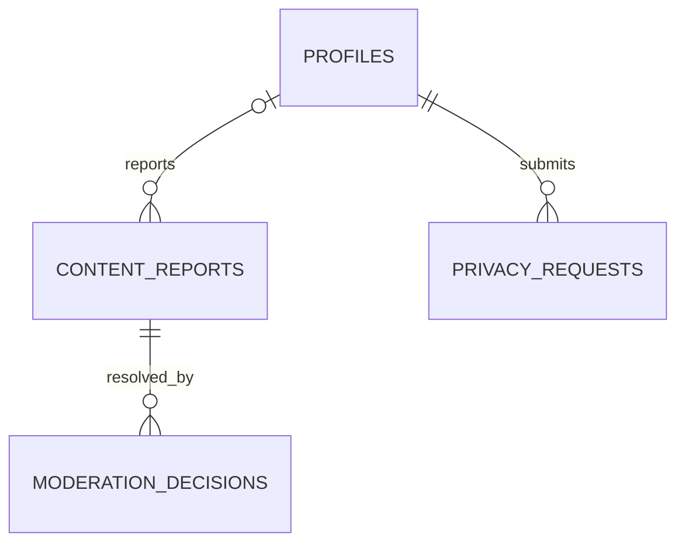

---

# 12. DAC7

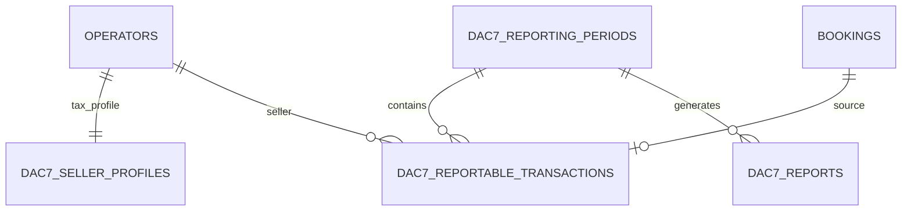

---

# 13. CENTRAL MARKETPLACE TRANSACTION

```text
CUSTOMER
   ↓
BOOKING
   ↓
BOAT
   ↓
LEGAL OFFERING
   ↓
OPERATOR
   ↓
PAYMENT
```

Simultaneously:

```text
BOOKING
   ↓
BOAT OCCUPANCY
   ↓
FLEET CALENDAR
```

and:

```text
BOOKING
   ↓
LEGAL ACCEPTANCE
   ↓
BOOKING CONTRACT
```

---

# 14. MARKETPLACE DISCOVERY

```text
DESTINATION / SEARCH INPUT
          ↓
OPERATOR LOCATION
          ↓
BOAT
          ↓
LEGAL / COMPLIANCE ELIGIBILITY
          ↓
AVAILABILITY
          ↓
PRICING
          ↓
SEARCH RESULT
```

---

# 15. MANUAL BOOKING

```text
OPERATOR
   ↓
OPERATOR CUSTOMER
   ↓
MANUAL BOOKING
   ↓
BOAT OCCUPANCY
   ↓
FLEET CALENDAR
```

Marketplace commission:

0%.

---

# 16. AVAILABILITY

```text
RECURRING AVAILABILITY
          -
ACTIVE BLOCKING OCCUPANCIES
          =
ACTUAL AVAILABLE SLOTS
```

Occupancy may be:

* booking;
* manual booking;
* hold;
* maintenance;
* transfer;
* private use;
* operator block.

---

# 17. OPERATOR MARKETPLACE ELIGIBILITY

```text
OPERATOR
   ↓
LEGAL/TAX PROFILE
   +
REQUIRED COMPLIANCE
   +
PAYMENT ONBOARDING
   +
PLATFORM APPROVAL
   ↓
MARKETPLACE ELIGIBLE
```

---

# 18. BOAT MARKETPLACE ELIGIBILITY

```text
ELIGIBLE OPERATOR
   +
COMPLETE BOAT
   +
APPROVED LEGAL OFFERING
   +
VALID COMPLIANCE
   +
PRICING
   +
AVAILABILITY
   +
PUBLICATION APPROVAL
   ↓
BOOKABLE BOAT
```

---

# 19. PAYMENT MODEL

```text
BOOKING
   ↓
PAYMENT
   ↓
STRIPE / CONNECT
   ↓
CUSTOMER AMOUNT
   ├── Boatly commission
   ├── Provider costs
   └── Operator economic amount
```

Potential later:

Refund

and:

Payout.

---

# 20. CONFIGURATION VS SNAPSHOT

Configuration:

current state.

Examples:

* price now;
* cancellation policy now;
* commission now;
* Terms now.

Booking history:

immutable state at transaction time.

This separation is mandatory.
